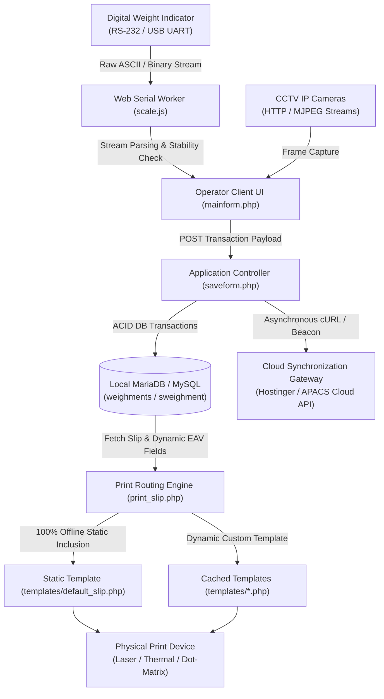
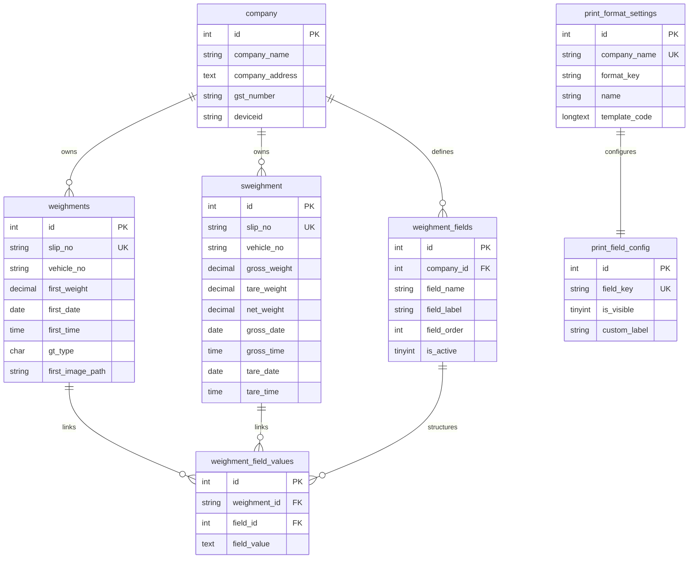

# ⚖️ Weighbridge Management System — Technical Specification & Architecture Document

A technical blueprint detailing the architectural patterns, hardware interfacing protocols, database schemas, rendering engines, and security models powering the Weighbridge Management System.

---

## 🛠️ 1. Technical Stack & Runtime Environment

| Layer | Technology / Specification | Details |
| :--- | :--- | :--- |
| **Backend Runtime** | PHP 8.x (Apache Module) | Procedural + OOP helpers, Native MySQLi with Parameterized Prepared Statements |
| **Database Engine** | MySQL 5.7+ / MariaDB 10.4+ | InnoDB storage engine, `utf8mb4_general_ci` character set, ACID transaction support |
| **Local Web Server** | Apache HTTP Server 2.4 | Deployed under XAMPP suite with standalone process daemon management |
| **Hardware Interfacing** | W3C Web Serial API (`navigator.serial`) | Low-latency binary/text stream parsing over USB-to-UART / RS-232 serial interfaces |
| **Surveillance Layer** | HTTP MJPEG Streams / HTML5 Canvas | Asynchronous video frame extraction and base64/JPEG snapshot serialization |
| **Client UI / Rendering** | Vanilla HTML5, CSS3, ES6+ JavaScript | Win32/Win95 high-legibility styling, CSS Paged Media `@page` print engine |
| **Cloud Synchronization** | RESTful JSON API via PHP cURL | Tokenized bearer authentication (APACS protocol) with asynchronous queueing |
| **Desktop Wrapper** | VBScript + Windows Batch Scripting | Automated daemon bootloader with Chromium/Edge native application kiosk flags |

---

## 🏛️ 2. Architectural Design Patterns



---

## 🔌 3. Hardware Interfacing & Serial Communication Protocol

### 3.1 Web Serial Engine (`scale.js`)
- **Browser-Native Port Access:** Leverages `navigator.serial.requestPort()` for direct browser-to-hardware communication without requiring ActiveX, Java applets, or third-party background agents.
- **Port Communication Parameters:**
  - **Baud Rates:** `9600`, `4800`, `2400` bps (configurable)
  - **Data Framing:** 8 Data Bits, No Parity (`none`), 1 Stop Bit (`8-N-1`)
  - **Buffer Flow Control:** Software stream reader via `TextDecoderStream` and `ReadableStreamDefaultReader`
- **Stream Frame Decoding Algorithm:**
  - Buffers continuous chunked streaming input.
  - Detects frame boundary terminators (`\r`, `\n`, `\x02` STX, `\x03` ETX).
  - Regex pattern matching isolates numerical payload: `([+-]?\d+(\.\d+)?)`
  - Extracts motion/stability control characters (`ST` = Stable, `US` = Unstable).
- **Fault Tolerance & Auto-Reconnection:**
  - Intercepts disconnect event listeners (`navigator.serial.addEventListener('disconnect')`).
  - Implements an exponential backoff reconnect loop without interrupting active UI input states.

---

## 📷 4. Multi-Channel CCTV Camera Vision Engine

- **Architecture:** 4-Channel multiplexed IP camera client module configured in `header.php`.
- **Streaming Protocol:** HTTP/MJPEG image video pipelines with user-pass authentication embedding.
- **Synchronized Transaction Snapshot Capture:**
  - Client grabs uncompressed frames across enabled channels upon clicking "Save Weighment".
  - Streams are converted to binary Blobs via HTML5 Canvas `toDataURL('image/jpeg', 0.85)` / background cURL fetches.
  - Server stores snapshots in `captures/` under structured file patterns:  
    `captures/{slip_no}_{gross|tare}_{channel_id}.jpg`
- **Tamper-Proof Slip Embed:** File paths are registered in transaction records and directly loaded into printable certificate image slots.

---

## 🖨️ 5. Print Slip Architecture & 100% Offline Engine

### 5.1 Dual-Tier Template Execution Pipeline
```
Step 1: Read 'ACTIVE_CHOICE' from print_format_settings
Step 2: Check local disk for templates/{active_format}.php
        ├── Found: Direct require_once() [Zero network latency, 100% offline]
        └── Not Found:
            ├── Check DB for cached template_code -> eval()
            └── Fallback: Always include templates/default_slip.php [Guaranteed Static Fail-Safe]
```

### 5.2 Supported Print Topologies & CSS Paged Media Specs
1. **Default Static Slip (`templates/default_slip.php`):**
   - 100% self-contained offline layout. Requires zero external CDNs, fonts, or assets.
   - Embeds company header, weights matrix, dynamic custom fields, and signature blocks.
2. **Standard Full-Page A4 Portrait (`format_standard_a4_portrait.php`):**
   - CSS: `@page { size: A4 portrait; margin: 0; }`
   - High-contrast typography with double-bordered weight summaries for legal certificates.
3. **Dual-Copy Stacked A4 with CCTV (`format_dual_landscape_cctv.php`):**
   - Height-constrained dual slips (Top & Bottom, 137mm each) with 2-channel CCTV photo evidence cards.
4. **Triplicate Multi-Copy Landscape (`format_triplicate_landscape.php`):**
   - CSS: `@page { size: A4 landscape; margin: 0; }`
   - CSS Flexbox layout dividing sheet into 3 equal columns: *Customer Copy*, *Transporter Copy*, *Security/Gate Copy*.
5. **Continuous Dot-Matrix Tractor Slip (`format_single_dotmatrix.php`):**
   - Monospaced Courier font rendering with raw ASCII dashed separators.
   - Zero-margin continuous roll feed tuning for dot-matrix printers (TVS-E, Epson LX/LQ series).

### 5.3 Dynamic Field & Visibility Configurator (`print_field_config`)
- Relational mapping of field keys to `is_visible` flags (Boolean `0`/`1`) and `custom_label` aliases.
- Evaluated inline via helper functions `showPrintField($key)` and `getPrintFieldLabel($key, $default)`.

---

## 🗄️ 6. Relational Database Schema & EAV Model



### Key Schema Highlights:
- **Transactional Separation:** First-stage weighments reside in `weighments`. Upon finalization, transactions migrate atomically into `sweighment` for fast indexed reporting and net weight queries.
- **Entity-Attribute-Value (EAV) Dynamic Schema:** `weighment_fields` + `weighment_field_values` decouple custom business data (e.g. *Client*, *Vessel*, *Driver License*, *SAP PO*) from hardcoded database tables.

---

## ☁️ 7. Hybrid Cloud Synchronization & Offline Queuing

- **Architecture:** Dual-Database Master-Master / Master-Replica hybrid sync topology.
- **Local Autonomy:** Zero operational blocking. Weighbridge operations continue uninterrupted during network partitions or cloud downtime.
- **Cloud Authentication Lifecycle (`apacs_login.php`):**
  - Obtains JSON Web Token (JWT) / API access tokens via HTTPS POST.
  - Automatically caches valid tokens locally and refreshes on HTTP 401 Unauthorized responses.
- **Asynchronous Retry Synchronization (`apacs_retry.php`):**
  - Unsynchronized weighment transactions are flagged and processed via automated queue workers.
  - Exponential backoff algorithm prevents flooding during partial network restoration.
- **Lifecycle Beacon Dispatcher:**
  - Implements HTML5 `navigator.sendBeacon` upon window/tab unload (`pagehide` event) to dispatch operator logout events to the cloud without blocking browser shutdown.

---

## 🔒 8. Security & System Hardening

- **SQL Injection Defense:** All write operations, user logins, and lookup queries utilize `mysqli::prepare()` parameterized statements with typed variable binding (`bind_param`).
- **Cross-Site Scripting (XSS) Mitigation:** Context-aware encoding using `htmlspecialchars(..., ENT_QUOTES, 'UTF-8')` across all print slip templates and form inputs.
- **Role-Based Access Control (RBAC):**
  - Role verification enforced via PHP sessions (`$_SESSION['role'] === 'admin'`).
  - Critical administration actions (Slip Reset, Database Backup/Restore, Dynamic Field Configuration) reject non-admin privileges with immediate `403 Forbidden` termination.
- **Automated Database Backups (`functions.php`):**
  - Native MySQL dump generator builds structured `.sql` snapshots timestamped to the second: `backups/weighbridge_backup_{d-m-Y_H-i-s}.sql`.
  - Embedded restore engine parses statements in transaction-safe batches.

---

## 🖥️ 9. Deployment Automation & Kiosk Runtime

- **Process Supervision (`start_weighbridge.bat`):**
  - Validates and exports binary runtime paths: `C:\xampp\php`, `C:\xampp\apache\bin`, `C:\xampp\mysql\bin`.
  - Inspects `tasklist` for active instances of `httpd.exe` and `mysqld.exe`, automatically launching unstarted background processes.
- **Silent VBScript Execution (`Weighbridge_App.vbs`):**
  - Executes batch bootstrap scripts with WindowStyle `0` (hidden), eliminating intrusive command prompt windows on industrial touch terminals.
- **Browser Kiosk Boot Flags:**
  ```cmd
  msedge.exe --app=http://localhost/weighbridge-printS/ --start-maximized --disable-http-cache --allow-running-insecure-content
  ```
  - `--app`: Launches browser in dedicated application window mode without URL address bar, navigation buttons, or tabs.
  - `--disable-http-cache`: Guarantees instant asset refresh for local hardware updates.


