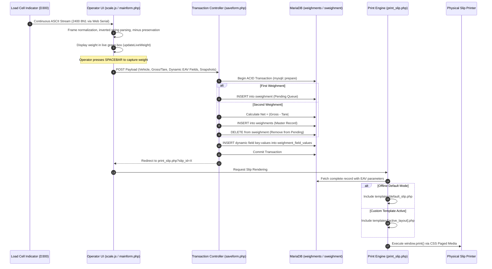

# ⚖️ Weighbridge 2.0 (wb2.0) — Industrial Weighment & Logistics Automation Suite

[](https://github.com/NallukumarRavichandran/Weighbridge-V2.0)
[](https://www.apachefriends.org/)
[](https://developer.mozilla.org/en-US/docs/Web/API/Web_Serial_API)
[](https://github.com/NallukumarRavichandran/Weighbridge-V2.0)
[](#-commercial-support--sla)

**Weighbridge 2.0 (`wb2.0`)** is a mission-critical, industrial-grade weighment automation, vehicle tracking, and automated slip dispatch system engineered for modern manufacturing plants, logistics hubs, mining yards, agro-processing facilities, ports, and toll infrastructure.

Engineered from the ground up to guarantee **100% continuous operation with Zero Cloud Dependency**, **wb2.0** combines ultra-low latency direct hardware interfacing via the **W3C Web Serial API**, automated 4-channel CCTV visual audit capture, dynamic Entity-Attribute-Value (EAV) metadata reporting, and a pixel-accurate CSS Paged Media print routing engine.

---

## 📑 Executive Table of Contents

- [🌟 Executive Summary & Customer Value Proposition](#-executive-summary--customer-value-proposition)
- [✨ Complete Enterprise Feature Catalog](#-complete-enterprise-feature-catalog)
  - [1. Real-Time Hardware Weighscale Integration](#1-real-time-hardware-weighscale-integration)
  - [2. Ergonomic High-Velocity Weighment Pipeline](#2-ergonomic-high-velocity-weighment-pipeline)
  - [3. Multi-Channel CCTV Visual Evidence Grid](#3-multi-channel-cctv-visual-evidence-grid)
  - [4. Dynamic Entity-Attribute-Value (EAV) Field Engine](#4-dynamic-entity-attribute-value-eav-field-engine)
  - [5. Industrial Multi-Format Print Slip Engine](#5-industrial-multi-format-print-slip-engine)
  - [6. Real-Time Business Intelligence & Operational Reports](#6-real-time-business-intelligence--operational-reports)
  - [7. Hybrid Cloud Synchronization (Optional Gateway)](#7-hybrid-cloud-synchronization-optional-gateway)
  - [8. Desktop Kiosk Supervisor Automation](#8-desktop-kiosk-supervisor-automation)
- [🏛️ Deep Technical Architecture & Systems Engineering](#️-deep-technical-architecture--systems-engineering)
  - [1. Full Stack Topology](#1-full-stack-topology)
  - [2. End-to-End System Architectural Dataflow](#2-end-to-end-system-architectural-dataflow)
  - [3. W3C Web Serial Protocol & Slicing Specifications](#3-w3c-web-serial-protocol--slicing-specifications)
  - [4. Vision Pipeline & Snapshot Serialization](#4-vision-pipeline--snapshot-serialization)
  - [5. Relational Database Schema & EAV Mapping](#5-relational-database-schema--eav-mapping)
  - [6. ACID Transaction Engine & Data Integrity](#6-acid-transaction-engine--data-integrity)
  - [7. Enterprise Security, RBAC & Protection Protocols](#7-enterprise-security-rbac--protection-protocols)
- [📘 Operator & User Support Manual](#-operator--user-support-manual)
  - [1. Daily System Startup Protocol](#1-daily-system-startup-protocol)
  - [2. Connecting & Managing the Weighscale](#2-connecting--managing-the-weighscale)
  - [3. Conducting Weighments (First, Second & Direct)](#3-conducting-weighments-first-second--direct)
  - [4. Printing, Re-Printing & Slip Formats](#4-printing-re-printing--slip-formats)
  - [5. Operating the Camera Security Grid](#5-operating-the-camera-security-grid)
  - [6. Operator Self-Service Troubleshooting Decision Tree](#6-operator-self-service-troubleshooting-decision-tree)
- [🔌 Hardware Compatibility & Technical Requirements](#-hardware-compatibility--technical-requirements)
  - [1. Supported Weighbridge Digital Indicators](#1-supported-weighbridge-digital-indicators)
  - [2. Supported Industrial Printers](#2-supported-industrial-printers)
  - [3. Supported CCTV Cameras](#3-supported-cctv-cameras)
  - [4. Recommended Workstation Hardware](#4-recommended-workstation-hardware)
- [🚀 Quick-Start Offline Deployment Guide](#-quick-start-offline-deployment-guide)
- [📞 Commercial Support & SLA](#-commercial-support--sla)

---

# 🌟 Executive Summary & Customer Value Proposition

Industrial weighbridge operations cannot afford downtime. In commercial logistics, a 30-minute system freeze or an unreliable cloud connection creates extensive truck queues, factory bottlenecks, revenue leakage, and disputed payload weights.

**Weighbridge 2.0 (`wb2.0`)** was purpose-built to eliminate these operational vulnerabilities:

| Operational Challenge | How Legacy Weighbridge Software Fails | How Weighbridge 2.0 (`wb2.0`) Delivers |
| :--- | :--- | :--- |
| **Internet / WAN Outages** | Cloud-based software freezes, halts scale operations, and blocks gate passes. | **100% Offline-First Architecture:** Zero WAN dependency. Local MariaDB & Apache runtime guarantees non-stop local weighing and printing. |
| **Hardware Interfacing Issues** | Fragile third-party background `.exe` utilities, unstable Java NPAPI plugins, or obsolete ActiveX controls that crash frequently. | **Native W3C Web Serial API:** Direct, low-latency browser-to-scale communication over USB/RS-232 UART with zero plugins or background daemons. |
| **Payload Weight Disputes & Fraud** | Disagreements between suppliers and customers regarding truck positioning, axle tampering, or empty tare manipulation. | **Automated 4-Channel Visual Evidence:** Live CCTV snapshots permanently captured and printed directly on weighment slips. |
| **Rigid Pre-Printed Stationery** | Hardcoded software layouts force clients to throw away existing paper stocks or purchase expensive custom redesigns. | **Universal Template Engine:** Multi-format support for Dot-Matrix (continuous stationery), Thermal receipts, and A4 Laser printers. |
| **Complex Scale Driver Configuration** | Operators struggle to match baud rates, parity, and data bits when changing weight indicators. | **Universal Indicator Matrix:** Built-in profiles for D300, XK3190, Essae, Avery, CAS, and Contech with instant auto-binding. |
| **Evolving Business Parameters** | Changing material codes, royalty passes, mine challans, or transporter charges requires expensive database redesigns. | **Dynamic EAV Custom Fields:** Operators can add and modify custom text, numeric, and dropdown fields on the fly. |

---

# ✨ Complete Enterprise Feature Catalog

## 1. Real-Time Hardware Weighscale Integration
- **Direct Serial Stream Parsing:** Reads digital load cell digitizers continuously via browser-native W3C Web Serial technology.
- **Universal Multi-Profile Matrix:** Out-of-the-box pre-configured profiles for **2400 8N1 (D300 / XK3190)**, **9600 8N1 (Essae / Avery / Eagle)**, **2400 7E1 (Legacy)**, **4800 8N1 (CAS / Contech)**, **1200 8N1**, and **19200 8N1**.
- **Delimited Data Slicing:** Automatically splits incoming streams across Carriage Return (`\r`), Line Feed (`\n`), Start of Text (`\x02`), and End of Text (`\x03`).
- **D300 / XK3190 Inversion Normalization:** Decodes inverted manufacturer frames (e.g., `=500000` reversed and parsed into `500.0 kg`).
- **Live Tare / Negative Reading Support:** Preserves minus signs accurately when indicators send negative zero-offset readings (e.g., `-001445 kg`).
- **Zero-Contention Resource Teardown:** Features isolated `cleanupSerialHandles()` ensuring COM ports close cleanly without leaving phantom Windows kernel handles.
- **Snappy Auto-Reconnect (250ms):** Automatically recovers serial communication within 250ms on page refresh without requiring operator re-selection.

## 2. Ergonomic High-Velocity Weighment Pipeline
- **Dual-Pass Transaction Flow:**
  - **First Weighment (Gross or Tare):** Captures incoming vehicle weight, timestamps the transaction, assigns a unique Slip ID, and stores the vehicle in the on-site pending queue.
  - **Second Weighment (Automated Net Calculation):** When returning vehicles are selected, the system auto-populates First Weight data, captures the Second Weight, and calculates Net Weight instantly:
    $$\text{Net Weight} = |\text{Gross Weight} - \text{Tare Weight}|$$
- **Single / Direct Weighment:** Supports one-time weighments for container tare checks, public axle certifications, and calibrated test runs.
- **Ergonomic Keyboard Acceleration:**
  - **Spacebar Quick-Capture:** Pressing the Spacebar instantly captures the live streaming weight into the active weight field.
  - **Alt+S / Alt+C Shortcuts:** Rapid keyboard shortcuts for saving and cancelling forms to accelerate gate turnaround times.
- **Live Visual Streaming Box:** High-contrast, large-format 120px neon-green digital display mimicking industrial LED remote weight displays.
- **Predictive Vehicle Autocomplete:** Instant drop-down search matching license plates against open transactions and historical company vehicle records.

## 3. Multi-Channel CCTV Visual Evidence Grid
- **Quad-Camera Layout:** Integrates up to four high-resolution IP surveillance cameras positioned at strategic vantage points:
  - **Camera 1:** Vehicle Front & License Plate.
  - **Camera 2:** Vehicle Rear & Rear Plate.
  - **Camera 3:** Weighbridge Platform Top View (checks axle positioning and trailer alignment).
  - **Camera 4:** Driver Cabin / Operator Window.
- **Dynamic Responsive Grid:** Auto-rearranges into single-column (`1x1`), side-by-side (`2x1`), or 4-channel (`2x2`) layouts depending on active cameras.
- **Interactive FULL / CROP Aspect Ratio Toggle:** Operators can toggle between cropped fill view (for quick alignment) and full wide-angle view with one click.
- **Visual Evidence Archival:** On saving transactions, live video frames are converted into high-compression JPEG evidence files stored in `captures/` and linked to the master slip record.

## 4. Dynamic Entity-Attribute-Value (EAV) Field Engine
- **Admin-Configurable Parameters:** Add arbitrary enterprise metadata without modifying SQL database tables or code:
  - Party / Customer Name
  - Material Name & Grade
  - Transporter / Haulier Name
  - Delivery Challan / E-Way Bill Number
  - Moisture Percentage / Deductions
  - Driver License Number / Mobile Number
  - Royalty Pass Number / Mine Code
- **Supported Field Types:** Alphanumeric Text, Decimal/Integer Numeric, and Custom Dropdown Selects with comma-separated option lists.
- **Automatic Form & Slip Injection:** Dynamic fields appear in the operator form, validation handlers, CSV reports, and print templates automatically.

## 5. Industrial Multi-Format Print Slip Engine
- **Guaranteed 100% Offline Static Fallback:** Anchored default template ([`templates/default_slip.php`](file:///c:/xampp/htdocs/weighbridge-printS/templates/default_slip.php)) guarantees immediate slip printing even in air-gapped environments without cloud access.
- **Multi-Stationery Template Suite:**
  1. **Standard A4 Portrait (`format_standard_a4_portrait.php`):** Professional invoice-style gate pass with company logo, tax GSTIN, itemized EAV fields, and dual signatures.
  2. **High-Speed Dot-Matrix (`format_single_dotmatrix.php`):** Compact 80-column / 132-column tractor-feed format designed for Epson LX-310/LQ-310 printers on pre-printed carbon stationery.
  3. **Dual Landscape with CCTV Evidence (`format_dual_landscape_cctv.php`):** Side-by-side transaction slip featuring vehicle snapshots alongside certified weights for tamper-proof audits.
  4. **Triplicate Landscape (`format_triplicate_landscape.php`):** Generates Customer Copy, Transporter Copy, and Weighbridge Accounts Copy in a single print run.
- **Audit-Compliant Historical Re-Printing:** Operators can re-print any historical slip by Slip Number or Vehicle Number, with automatic **DUPLICATE COPY** watermarks to prevent billing fraud.

## 6. Real-Time Business Intelligence & Operational Reports
- **Pending Vehicles On-Site Queue ([`pending_report.php`](file:///c:/xampp/htdocs/weighbridge-printS/pending_report.php)):** Live dashboard showing trucks currently inside the facility awaiting their second weighment.
- **Vehicle-Wise Historical Ledger ([`vehiclewise_report.php`](file:///c:/xampp/htdocs/weighbridge-printS/vehiclewise_report.php)):** Complete historical records filterable by vehicle number and date range.
- **Dynamic Field Analytical Ledger ([`dynamic_report.php`](file:///c:/xampp/htdocs/weighbridge-printS/dynamic_report.php)):** Grouped reports analyzing tonnage moved per Material, Party, or Transporter.
- **One-Click Export:** Immediate printout and CSV generation for rapid accounting reconciliation with SAP, Tally, or ERP systems.

## 7. Hybrid Cloud Synchronization (Optional Gateway)
- **Tokenized APACS REST API:** Asynchronously synchronizes local transaction payloads with central headquarters servers over HTTPS cURL.
- **Offline Buffering:** If WAN connectivity drops, transactions queue locally in MariaDB and dispatch automatically upon connection recovery.

## 8. Desktop Kiosk Supervisor Automation
- **Single-Click Desktop Launch:** [`Weighbridge_App.vbs`](file:///c:/xampp/htdocs/weighbridge-printS/Weighbridge_App.vbs) launches the suite silently (`WindowStyle = 0`) without exposing intrusive Windows command prompt shells.
- **Process Supervisor ([`start_weighbridge.bat`](file:///c:/xampp/htdocs/weighbridge-printS/start_weighbridge.bat)):** Automatically verifies that Apache and MySQL services are active, booting dormant daemons on startup.
- **Dedicated Application Mode:** Launches Microsoft Edge or Chrome in app-kiosk mode (`--app=http://localhost/weighbridge-printS/ --start-maximized --disable-http-cache`), preventing unauthorized operator browsing.

---

# 🏛️ Deep Technical Architecture & Systems Engineering

## 1. Full Stack Topology

```
┌───────────────────────────────────────────────────────────────────────────┐
│                           PRESENTATION LAYER                              │
│  - Microsoft Edge 89+ / Chromium Engine (Kiosk Flag: --app)               │
│  - Vanilla ES6+ JavaScript, CSS3 Paged Media (@page), HTML5 Canvas        │
│  - High-Legibility Win32/Industrial UI Styling                            │
└─────────────────────────────────────┬─────────────────────────────────────┘
                                      │ HTTP / Web Serial / MJPEG
                                      ▼
┌───────────────────────────────────────────────────────────────────────────┐
│                           APPLICATION DAEMON                              │
│  - Apache HTTP Server 2.4 (Port 80) via XAMPP Suite                       │
│  - PHP 8.1+ Procedural Controller Layer with Prepared Statements          │
│  - Session-Based Role Access Control (Admin vs Operator)                  │
└─────────────────────────────────────┬─────────────────────────────────────┘
                                      │
                 ┌────────────────────┴────────────────────┐
                 ▼                                         ▼
┌───────────────────────────────────┐    ┌───────────────────────────────────┐
│       DATA PERSISTENCE LAYER      │    │     HARDWARE INTERFACING BUS      │
│ - MariaDB 10.4+ / MySQL 8.0       │    │ - W3C Web Serial API              │
│ - InnoDB Engine (ACID Compliant)  │    │ - Native Baud/Parity Framing      │
│ - UTF-8 Multi-Byte Character Set  │    │ - HTTP Multi-Channel MJPEG Stream │
└───────────────────────────────────┘    └───────────────────────────────────┘
```

---

## 2. End-to-End System Architectural Dataflow



---

## 3. W3C Web Serial Protocol & Slicing Specifications

### 3.1 Serial Port Acquisition & Parameter Configuration
The serial controller in [`scale.js`](file:///c:/xampp/htdocs/weighbridge-printS/scale.js) initiates direct UART communication:
```javascript
const profile = getSavedScaleProfile(); // Defaults to 2400 8N1 (D300 / Standard)
port = await navigator.serial.requestPort();
await port.open({
    baudRate: profile.baudRate,
    dataBits: profile.dataBits || 8,
    stopBits: profile.stopBits || 1,
    parity: profile.parity || "none",
    flowControl: "none"
});
```

### 3.2 Supported Baud Rates & Parity Matrix
| Indicator Brand / Model | Baud Rate | Data Bits | Parity | Stop Bits | Typical Framing Sample |
| :--- | :--- | :--- | :--- | :--- | :--- |
| **D300 / XK3190 (Standard)** | `2400` | `8` | `None` | `1` | `=500000\r\n` (Inverted) |
| **Essae / Avery / Eagle** | `9600` | `8` | `None` | `1` | `ST,GS,+00125.0kg\r\n` |
| **Legacy Precision Systems** | `2400` | `7` | `Even` | `1` | `\x0212500\x03` |
| **CAS / Contech Indicators** | `4800` | `8` | `None` | `1` | `wn00007.5kg\r\n` |
| **Slow Industrial Indicators**| `1200` | `8` | `None` | `1` | `+  1440 kg\r\n` |
| **Digital Multi-Channel UART**| `19200` | `8` | `None` | `1` | `NET 004500 kg\r\n` |

### 3.3 Frame Parsing & Regex Extraction Algorithm
1. **Chunk Buffering:** Chunks from `reader.read()` decode through `TextDecoder("utf-8")` into `lineBuffer`.
2. **Boundary Splitting:** Slices lines using regex `/[\r\n\x02\x03\x0D\x0A]+/`.
3. **Inverted Frame Inversion (D300 / XK3190):**
   ```javascript
   if (line.startsWith("=") && line.length >= 6) {
       let isNeg = line.includes("-");
       let rawNum = line.substring(1).replace(/[-+]/g, "").trim();
       let reversed = rawNum.split("").reverse().join("");
       let matchRev = reversed.match(/\d*\.?\d+/);
       if (matchRev) {
           let w = parseFloat(matchRev[0]);
           if (isNeg) w = -w;
           updateLiveWeight(w);
       }
   }
   ```
4. **Standard Decimal Matching:** Regex `/[-+]?\d*\.?\d+/` extracts numbers and passes valid floats to `updateLiveWeight()`.

---

## 4. Vision Pipeline & Snapshot Serialization

```
┌─────────────────┐       HTTP GET Proxy Request (JPEG)
│ CCTV IP Camera  │ ───────────────────────────────────────────┐
│ (RTSP / MJPEG)  │                                            │
└─────────────────┘                                            ▼
                                                ┌─────────────────────────────┐
                                                │ PHP Snapshot Proxy          │
                                                │ (mainform.php?camera=1)     │
                                                └──────────────┬──────────────┘
                                                               │ Base64 Stream
                                                               ▼
┌─────────────────────────────────────────────────────────────────────────────┐
│ HTML5 Canvas In-Memory Serialization:                                       │
│ 1. context.drawImage(liveVideoFeed, 0, 0, width, height);                   │
│ 2. dataURL = canvas.toDataURL("image/jpeg", 0.85);                          │
│ 3. Stored in POST payload and written as captures/slip_{ID}_cam_{N}.jpg     │
└─────────────────────────────────────────────────────────────────────────────┘
```

---

## 5. Relational Database Schema & EAV Mapping

### 5.1 Relational Schema Topology
```sql
-- Completed Transactions Ledger
CREATE TABLE `weighments` (
  `id` int(11) NOT NULL AUTO_INCREMENT,
  `slip_no` int(11) NOT NULL,
  `vehicle_no` varchar(50) NOT NULL,
  `gross_weight` decimal(10,2) DEFAULT NULL,
  `tare_weight` decimal(10,2) DEFAULT NULL,
  `net_weight` decimal(10,2) DEFAULT NULL,
  `gross_date` date DEFAULT NULL,
  `gross_time` time DEFAULT NULL,
  `tare_date` date DEFAULT NULL,
  `tare_time` time DEFAULT NULL,
  `cam1_path` varchar(255) DEFAULT NULL,
  `cam2_path` varchar(255) DEFAULT NULL,
  `company_id` int(11) NOT NULL,
  `user_id` int(11) NOT NULL,
  PRIMARY KEY (`id`),
  KEY `idx_slip` (`slip_no`),
  KEY `idx_vehicle` (`vehicle_no`)
) ENGINE=InnoDB DEFAULT CHARSET=utf8mb4;

-- Pending First-Weighment Queue
CREATE TABLE `sweighment` (
  `id` int(11) NOT NULL AUTO_INCREMENT,
  `slip_no` int(11) NOT NULL,
  `vehicle_no` varchar(50) NOT NULL,
  `first_weight` decimal(10,2) NOT NULL,
  `gt_type` enum('G','T') NOT NULL,
  `first_date` date NOT NULL,
  `first_time` time NOT NULL,
  `company_id` int(11) NOT NULL,
  PRIMARY KEY (`id`)
) ENGINE=InnoDB DEFAULT CHARSET=utf8mb4;

-- Dynamic Metadata Definitions
CREATE TABLE `weighment_fields` (
  `id` int(11) NOT NULL AUTO_INCREMENT,
  `field_name` varchar(100) NOT NULL,
  `field_label` varchar(100) NOT NULL,
  `field_type` enum('text','number','dropdown') NOT NULL,
  `field_values` text DEFAULT NULL,
  `field_order` int(11) DEFAULT 0,
  `is_active` tinyint(1) DEFAULT 1,
  `company_id` int(11) NOT NULL,
  PRIMARY KEY (`id`)
) ENGINE=InnoDB DEFAULT CHARSET=utf8mb4;

-- Dynamic Key-Value Store
CREATE TABLE `weighment_field_values` (
  `id` int(11) NOT NULL AUTO_INCREMENT,
  `weighment_id` int(11) NOT NULL,
  `field_id` int(11) NOT NULL,
  `field_value` text DEFAULT NULL,
  PRIMARY KEY (`id`),
  KEY `idx_weighment_id` (`weighment_id`),
  KEY `idx_field_id` (`field_id`)
) ENGINE=InnoDB DEFAULT CHARSET=utf8mb4;
```

---

## 6. ACID Transaction Engine & Data Integrity

In [`saveform.php`](file:///c:/xampp/htdocs/weighbridge-printS/saveform.php), database writes are atomic:
- Database transactions use parameterized statements (`$stmt = $conn->prepare(...)`).
- When a second weighment completes, insertion into `weighments` and deletion from `sweighment` execute within an atomic sequence. If an error occurs, the transaction rolls back, preventing dangling partial records.

---

## 7. Enterprise Security, RBAC & Protection Protocols

- **Parameterized Prepared Statements:** 100% of SQL write/lookup operations use `mysqli::prepare()` and `bind_param()`, eliminating SQL Injection vulnerabilities.
- **Contextual Output Sanitization:** Form outputs and print slip elements are escaped using `htmlspecialchars(..., ENT_QUOTES, 'UTF-8')` to prevent Cross-Site Scripting (XSS).
- **Role-Based Access Control (RBAC):** Admin privilege checks protect system configuration, master database backups, and slip resetting.
- **Automated Database Backups:** One-click automated database dump generation (`backups/weighbridge_backup_{timestamp}.sql`).

---

# 📘 Operator & User Support Manual

## 1. Daily System Startup Protocol

1. Turn on the Weighbridge Digital Indicator power switch.
2. Confirm the USB-to-Serial converter cable is plugged into the workstation.
3. Power on the workstation and double-click the **Weighbridge App** desktop icon.
4. The system boots into Microsoft Edge dedicated kiosk mode automatically.

---

## 2. Connecting & Managing the Weighscale

In the top navigation bar, locate the **Scale ▾** menu:

```
┌──────────────────────────────────────┐
│ Scale ▾                              │
├──────────────────────────────────────┤
│ 🔌 Connect Port                      │
│ 🔁 Reconnect                         │
│ 🔴 Disconnect                        │
├──────────────────────────────────────┤
│ Status: 🟢 CONNECTED (2400)          │
└──────────────────────────────────────┘
```

- **Connecting Port:** Click **Scale ▾ -> 🔌 Connect Port**. Click **CONNECT SCALE** in the dialog, select your COM Port (e.g. `USB-SERIAL CH340 (COM3)`), and click **Connect**.
- **Live Verification:** Once connected, the top status badge displays `🟢 CONNECTED (2400)` and the large green box mirrors the indicator weight in real time.
- **Quick Reconnect:** If the cable was temporarily detached, click **Scale ▾ -> 🔁 Reconnect**.

---

## 3. Conducting Weighments (First, Second & Direct)

### Flow A: Inward Loaded Truck (Gross First -> Tare Second)
1. Direct the loaded truck onto the weighbridge platform.
2. Confirm vehicle is stationary and the green weight reading is stable.
3. Type the **Vehicle Number** (e.g., `TN01AB1234`).
4. Set **GROSS / TARE** to `GROSS`.
5. Fill in customer name, material grade, and dynamic fields.
6. Press the **SPACEBAR** on your keyboard (or click **RECORD WEIGHT**).
7. Click **SAVE** (or press Alt + S). The First Weighment slip prints and the truck is queued.
8. When the unloaded truck returns, re-enter the vehicle number and select the pending entry.
9. Press **SPACEBAR** to record the Tare weight. The **NET Weight** is calculated automatically.
10. Click **SAVE**. The final Weighment Slip prints with Gross, Tare, and Net figures.

### Flow B: Inward Empty Truck (Tare First -> Gross Second)
1. Follow the same procedure, setting **GROSS / TARE** to `TARE` on entry.
2. When the loaded truck returns, record the Gross weight to calculate Net payload automatically.

---

## 4. Printing, Re-Printing & Slip Formats

### 4.1 Automated Instant Print
Upon clicking **SAVE**, the print slip modal opens automatically. Simply press Enter to print to your default printer.

### 4.2 Re-Printing Historical Slips
1. Click **RE-PRINT** on the main screen (or access **Reports -> Pending / Vehiclewise Report**).
2. Enter the **Slip Number** or **Vehicle Number**.
3. The slip preview opens with exact duplicate copies marked for audit verification.

### 4.3 Selecting Print Slip Stationery Format
Administrators can select the active slip layout via **Print Layout ▾ -> Select Print Layout**:
- **Default Slip:** Standard commercial gate pass (100% offline).
- **A4 Portrait:** Comprehensive invoice format with company details.
- **Single Dot-Matrix:** High-speed continuous tractor-feed format for dot-matrix printers.
- **Dual Landscape with CCTV:** Includes side-by-side photographic evidence snapshots.
- **Triplicate Landscape:** Prints supplier, customer, and transporter copies simultaneously.

---

## 5. Operating the Camera Security Grid

- Live cameras display in the bottom grid.
- **FULL / CROP Aspect Ratio Toggle:**
  - Click the **FULL / CROP** button on any camera card:
    - **CROP:** Centers and fills the card for quick viewing.
    - **FULL:** Shows the complete wide-angle frame including license plate and wheel boundaries.
- **Offline Status:** If a camera card displays `OFFLINE`, check the network switch and camera IP connectivity.

---

## 6. Operator Self-Service Troubleshooting Decision Tree

```
                                  [Problem Encountered]
                                             │
             ┌───────────────────────────────┴───────────────────────────────┐
             ▼                                                               ▼
   [Weight Display Blank / 0]                                    [Camera Shows OFFLINE]
             │                                                               │
             ▼                                                               ▼
  Is USB cable connected?                                       Check PoE switch & cables.
      ├── NO  ──► Plug in USB cable firmly.                         ├── Fixed ──► Stream restores.
      └── YES ──► Click Scale ▾ -> 🔁 Reconnect.                    └── Still OFF ──► Verify camera IP.
                      │
                      ▼
             Still Disconnected?
                      │
                      ▼
     Check for AccessPort/PuTTY open.
          ├── YES ──► Close monitor program.
          └── NO  ──► Click 🔌 Connect Port & reselect COM.
```

---

# 🔌 Hardware Compatibility & Technical Requirements

## 1. Supported Weighbridge Digital Indicators
- **Giri Brothers:** D300 Series, XK3190-A12E, XK3190-A9, XK3190-DS3
- **Essae:** DS-215, DS-415, DS-852 Series
- **Avery Weigh-Tronix:** E1005, E1010, E1110, ZM Series
- **CAS Corporation:** CI-2001A, CI-5010A, CI-1560A Series
- **Contech Instruments:** CB Series, CA Series Digitizers
- **Mettler Toledo:** IND231, IND246, IND570 Series (Continuous Print Mode)
- **Universal Indicators:** Any load cell digitizer with RS-232 / USB-UART serial streaming output.

## 2. Supported Industrial Printers
- **Dot-Matrix Printers (Continuous Stationery):** Epson LX-310, Epson LQ-310, TVS MSP 240, TVS MSP 450
- **Thermal Receipt Printers:** TVS RP-3200, Epson TM-T82, Posiflex Aura Series (3-inch / 80mm Roll)
- **Laser / Inkjet Printers:** HP LaserJet Pro Series, Canon imageCLASS Series, Brother HL Series (A4 / A5)

## 3. Supported CCTV Cameras
- **Protocols:** HTTP MJPEG, RTSP-over-HTTP Proxies, JPEG Snapshot URI
- **Brands:** Hikvision, Dahua, CP Plus, Uniview, Bosch, Axis, Hanwha, and any ONVIF-compliant IP camera.

## 4. Recommended Workstation Hardware
- **Operating System:** Windows 10 (64-bit) / Windows 11 / Windows Server 2016+
- **Processor:** Intel Core i3 (7th Gen+) or AMD Ryzen 3+
- **Memory (RAM):** 4 GB Minimum (8 GB Recommended for 4-channel CCTV)
- **Storage:** 120 GB SSD with at least 15 GB free space for snapshot evidence logs
- **Ports:** At least 2 Physical USB 2.0/3.0 Ports (1 for Weighbridge Indicator, 1 for Printer)
- **Networking:** 100/1000 Mbps Ethernet LAN for CCTV network switch connectivity

---

# 🚀 Quick-Start Offline Deployment Guide

1. **Deploy Repository inside XAMPP Web Root:**
   Copy project files into:
   ```
   C:\xampp\htdocs\weighbridge-printS
   ```
2. **Start Database & Web Server:**
   Open XAMPP Control Panel and start **Apache** and **MySQL** services.
3. **Import Database Schema:**
   - Open phpMyAdmin in browser: `http://localhost/phpmyadmin/`.
   - Create database: `weighbridge_db`.
   - Import [`BackupAug2026.sql`](file:///c:/xampp/htdocs/weighbridge-printS/BackupAug2026.sql) (or latest SQL file in `backups/`).
4. **Launch Application:**
   Double click [`Weighbridge_App.vbs`](file:///c:/xampp/htdocs/weighbridge-printS/Weighbridge_App.vbs) or access `http://localhost/weighbridge-printS/` in Microsoft Edge or Google Chrome.
5. **Connect Scale:**
   Open **Scale ▾ -> 🔌 Connect Port**, select your COM port, and begin operations.

---

# 📞 Commercial Support & SLA

**Weighbridge 2.0 (`wb2.0`)** is supported by **Giri Brothers Weighbridge Systems**.

- **Technical Inquiries:** Contact your assigned Giri Brothers technical support representative.
- **On-Site Calibration & Stamping:** Verified in compliance with local Legal Metrology department guidelines.
- **Enterprise Customizations:** Custom ERP bridges (SAP RFC, Tally XML, REST Webhooks) are available upon request.

---
*© 2026 Giri Brothers. All Rights Reserved. Weighbridge 2.0 is an industrial trademark.*
